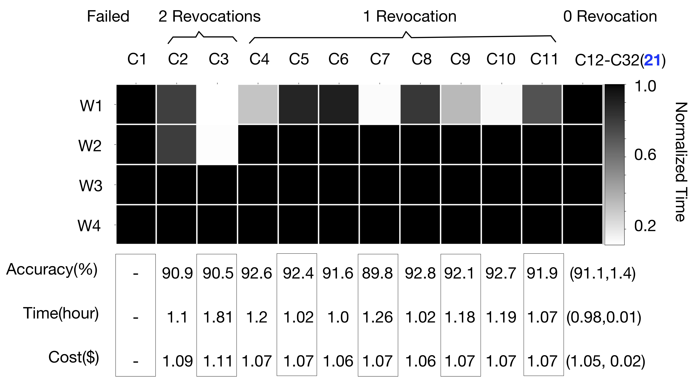
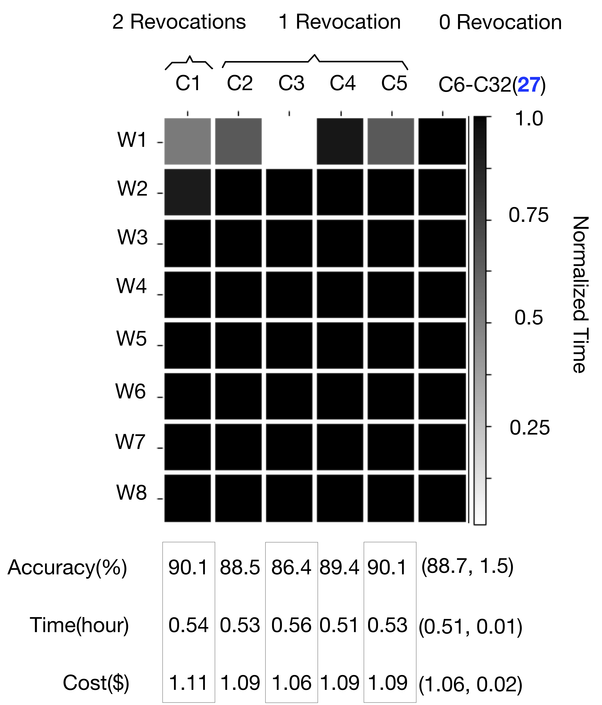

# Speeding up Deep Learning with Transient Servers

## About

This repo is for the paper "Speeding up Deep Learning with Transient Servers" presented at ICAC 2019.

The paper explores the opportunity of conducting distributed training of deep neural networks with transient cloud resources, especially the GPU servers. The transient resources are cheaper than on-demand ones, but with the caveat of being revoked by the cloud provider at any given time. By using transient cloud servers, we achieved the potential of up to 62.9% monetary savings and consequently 7.7X speed up due to the spare budget to deploy more servers in training. We also identified several opportunities for both cloud infrustracture and deep learning frameworks to provide better support for transient distributed training. 

The repo contains code, found in `code` folder, to reproduce experiments mentioned in the paper. The code will request cloud resources that the user specify, propagate training scripts and set up distributed training jobs on the servers. The repo also provide experiment data shown in the paper, located in the `data` folder. For details on the data, please see readme inside `data` folder.

#### Highlight

- Our data driven approach shows that by using transient cloud servers, we can achieve the potential of up to 62.9% monetary savings and 7.7X speed up compared to single server baseline. 

- By launching large scale transient cloud servers, we are able to gather data of the impact transient revocation has on training performance, in terms of training time, cost, and converged accuracy and trained models.

- We demonstrates several benefits and limitations of using heterogeneous servers in distributed training. In particular, our findings suggest a number of plausible transient-aware designs for deep learning frameworks, including the ability to train with dynamic cluster sizes, to better exploit these cheap transient servers. 



<!--  -->

**Training performance and cost of using cluster with 4 transient K80 GPU servers**


<!--  -->

**Training performance and cost of using cluster with 8 transient K80 GPU servers**


<!--  -->

**Training cost of using different configurations of heterogeneous clusters with 4 GPU servers**

## How to use the code

#### Dependency and cloud image

The code used custom cloud images for both GPU and CPU servers, and the images are currently not public. Thus in order to run it, you need to create two custom images first.

We ran the code on cloud servers with Ubuntu 18.04 LTS, 4-8 vCPU cores and 24-51 GB memory, with 100 GB disk space. Ubuntu 16.04 LTS might work, but with some unexpected behavior.

First create a VM and `ssh` onto it.

Then update apt-get and install the dependencies. 
```bash
sudo apt-get update
sudo apt-get install -y openjdk-8-jdk git python-dev python3-dev python-numpy python3-numpy build-essential python-pip python3-pip python-virtualenv swig python-wheel libcurl3-dev curl g++ freeglut3-dev libx11-dev libxmu-dev libxi-dev libglu1-mesa libglu1-mesa-dev
```

Install nvidia drivers, the code is based on CUDA 9.0. Notice: all the CUDA and CUDNN related dependency are not required for CPU image.
```bash
### Install NVIDIA driver
sudo apt install nvidia-384 nvidia-384-dev
### CUDA 9.0 requires gcc 6.0
sudo apt install gcc-6
sudo apt install g++-6
### Get CUDA 9.0 files and install
wget https://developer.nvidia.com/compute/cuda/9.0/Prod/local_installers/cuda_9.0.176_384.81_linux-run
chmod +x cuda_9.0.176_384.81_linux.run
sudo ./cuda_9.0.176_384.81_linux.run --override
```

After rebooting VM, check if cuda is installed properly.
```bash
sudo reboot
nvidia-smi
```

An operational GPU would return something like:
```
+-----------------------------------------------------------------------------+
| NVIDIA-SMI 396.26                 Driver Version: 396.26                    |
|-------------------------------+----------------------+----------------------+
| GPU  Name        Persistence-M| Bus-Id        Disp.A | Volatile Uncorr. ECC |
| Fan  Temp  Perf  Pwr:Usage/Cap|         Memory-Usage | GPU-Util  Compute M. |
|===============================+======================+======================|
|   0  Tesla K80           Off  | 00000000:00:04.0 Off |                    0 |
| N/A   35C    P8    27W / 149W |     15MiB / 11441MiB |      0%      Default |
+-------------------------------+----------------------+----------------------+
                                                                               
+-----------------------------------------------------------------------------+
| Processes:                                                       GPU Memory |
|  GPU       PID   Type   Process name                             Usage      |
|=============================================================================|
|    0      1658      G   /usr/lib/xorg/Xorg                            14MiB |
+-----------------------------------------------------------------------------+
```

Install CUDNN 7.5, you need to go to Nvidia website and register, then download the `tar` file and install it.


Edit cuda path to `~/.bashrc` and reload it
```bash
echo 'export PATH=/usr/local/cuda-9.0/bin:$PATH' >> ~/.bashrc
echo 'export LD_LIBRARY_PATH=/usr/local/cuda-9.0/lib64:$LD_LIBRARY_PATH' >> ~/.bashrc
source ~/.bashrc
```

Don't forget to move CUDNN to CUDA folder.
```
sudo cp -P cuda/include/cudnn.h /usr/local/cuda-9.0/include
sudo cp -P cuda/lib64/libcudnn* /usr/local/cuda-9.0/lib64/
sudo chmod a+r /usr/local/cuda-9.0/lib64/libcudnn*
```

The last step would be to install `TensorFlow 1.10` and modified `Tensor2Tensor`. `Tensor2Tensor` is can be found in the `code` folder.
```bash
sudo pip install tensorflow-gpu==1.10
## for cpu servers install tensorflow==1.10 instead
pip install -e ~/code/tensor2tensor
```

After the dependency installation, make two images, one for workers and one for parameter servers. Example command as below(to create instance-gpu and instance-cpu images that we used in the code):
```bash
gcloud compute instances set-disk-auto-delete instance-gpu \
--disk instance-gpu --no-auto-delete

gcloud compute instances set-disk-auto-delete instance-cpu \
--disk instance-cpu --no-auto-delete

gcloud compute images create gpu-ubuntu18 \
--source-disk instance-gpu

gcloud compute images create cpu-ubuntu18 \
--source-disk instance-cpu
```

#### Running the code

The code supports training models implemented in Tensor2Tensor library. For the paper we mainly used ResNet models. The code currently support Google Compute Engine.

To run the code, simply input the following command. It will set up a cluster with 1 parameter server and 4 workers equipt with K80 GPU, and train CIFAR-10 dataset on ResNet-32 for 64k steps. The trained model will be generated in the specified cloud bucket. 

```bash
python main.py --job-name=res32k801 --num-ps=1 --ps-core-num=4 --num-worker=4 --num-shard=1 --bucket-dir=gs://YOUR_BUCKET/ --model=resnet --hparam-set=resnet_cifar_32 --problem=image_cifar10 --train-steps=64000 --ckpt-frequency=100000 --automation-test=0 --setSlot=1 --maxWorker=8 --gpu=k80
```

Other parameter explanation can be found below, they are experimental and not the core focus of the paper:

* ps-core-num: determines the number of vCPU cores for parameter servers. 

* num-shard: how many shards to partition the parameter set.

* ckpt-frequency: how frequent to checkpoint during training.

* automation-test: only used in combination with a monitor, currently not supported.

* setSlot: part of test for dynamic learning rate.

* maxWorker: part of test for dynamic learning rate.

## Citation

If you would like to cite the paper, please cite as:

```bib
@inproceedings{2019icac:speedup,
	author = {Li, Shijian and Walls, Robert J. and  Xu, Lijie and Guo, Tian}, 
	title = {"Speeding up Deep Learning with Transient
  		Servers"},
	booktitle =  {Proceedings of the 16th IEEE International Conference on Autonomic Computing (ICAC'19) }, 
	year = {2019},
}
```

## Acknowledgement

We thank all our anonymous reviewers for their insightful comments. This work is supported in part by National Science Foundation grants #1755659 and #1815619, Google Cloud Platform Research credits, the National Natural Science Foundation of China (61802377), and the Youth Innovation Promotion Association at CAS.

## Contact

Our lab [Github](https://cake-lab.github.io/projects/)

- Shijian Li [sli8@wpi.edu](sli8@wpi.edu)

- Robert Walls [rjwalls@wpi.edu](rjwalls@wpi.edu)

- Tian Guo [tian@wpi.edu](tian@wpi.edu)